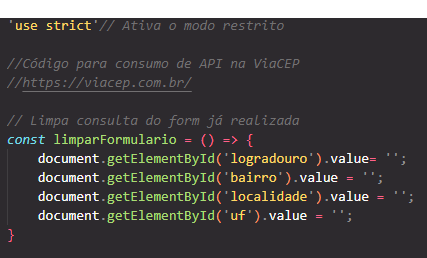

# Projeto de validação de e-mail e CPF com JavaScript 

## Índice
* [Introdução](#introdução)
* [Funcionalidades](#funcionalidades)
* [Lógica do código](#lógica-do-código)
* [Técnicas e tecnologias utilizadas](#técnicas-e-tecnologias-utilizadas)
* [Fontes Consultadas](#fontes-consultadas)
* [Autor(a)](#autora)

## Introdução
Este código JavaScript oferece uma funcionalidade completa para consulta de endereços a partir de um CEP (Código de Endereçamento Postal) brasileiro, utilizando a API do ViaCEP. Ele automatiza o processo de preenchimento de um formulário com as informações obtidas da API, proporcionando uma experiência mais fluida para o usuário.

 

## Funcionalidades
O código JavaScript apresentado tem como objetivo principal automatizar a busca e preenchimento de informações de endereços a partir de um CEP (Código de Endereçamento Postal) brasileiro, utilizando a API do ViaCEP.

**Interface com o Usuário:**

- O código interage com o usuário através de um formulário HTML, onde o usuário insere o CEP desejado.
- Ao sair do campo de CEP (evento focusout), a função pesquisarCep() é acionada.

**Validação do CEP:**

- A função pesquisarCep() verifica se o CEP inserido possui 8 dígitos numéricos.
- Caso o CEP seja inválido, uma mensagem de alerta é exibida para o usuário.

**Consulta à API do ViaCEP:**

- Se o CEP for válido, uma requisição HTTP é feita para a API do ViaCEP, que é um serviço gratuito que fornece informações sobre endereços a partir de CEPs brasileiros.
- A URL da requisição é construída concatenando a URL base da API com o CEP informado.

**Tratamento da Resposta:**

A resposta da API, que é um objeto JSON, é analisada:

- CEP não encontrado: Se a propriedade erro estiver presente no objeto JSON, significa que o CEP não foi encontrado e uma mensagem de alerta é exibida para o usuário.
- CEP encontrado: Caso contrário, as informações do endereço (logradouro, bairro, localidade e UF) são extraídas do objeto JSON e preenchidas nos campos correspondentes do formulário.

 

# Lógica do código
## Função limparFormulario

``'use strict';``: Essa linha ativa o modo restrito do JavaScript, tornando o código mais seguro e evitando erros comuns.
 

``const limparFormulario = () => { ... }``:
- ``const:`` Declara uma constante chamada limparFormulario.
- ``= () => { ... }``: Define uma função anônima (arrow function) que será atribuída à constante.

 

``document.getElementById('logradouro').value= '';``:
- ``document.getElementById('logradouro')``: Seleciona o elemento HTML com o ID 'logradouro' (provavelmente um input).
- ``.value = '';``: Atribui uma string vazia ao valor desse elemento, limpando o campo.
As outras linhas fazem o mesmo para os elementos 'bairro', 'localidade' e 'uf'.

## Validação de CEP 

``const eNumero = (numero) => /^[0-9]+$/.test(numero);``: Verifica se uma string contém apenas números.
- ``^ e $``: Esses caracteres garantem que a expressão regular corresponda à string inteira, do início ao fim.
- ``[0-9]+``: Essa parte da expressão define um conjunto de caracteres que vão de 0 a 9 e o quantificador ``+`` indica que pode haver um ou mais desses dígitos.
- ``.test(numero)``: O método ``test()`` da expressão regular é utilizado para verificar se a string ``numero`` corresponde ao padrão definido. Retorna ``true`` se corresponder e ``false`` caso contrário.

 

``const cepValido = (cep) => cep.length == 8 && eNumero(cep);``:  Verifica se um CEP é válido, considerando o tamanho e se contém apenas números.
- ``cep.length == 8:`` Verifica se o comprimento da string ``cep`` é exatamente 8 caracteres, que é o tamanho padrão de um CEP no Brasil.
- ``eNumero(cep):`` Chama a função ``eNumero`` para verificar se a string ``cep`` contém apenas números.
- ``&&:`` O operador lógico ``&&`` (e) garante que ambas as condições sejam verdadeiras para que a função ``cepValido`` retorne ``true``.

## Função preencherFormulario

``const preencherFormulario = (endereco) => {:``
- ``const:`` Declara a função como constante, ou seja, ela não pode ser reatribuída.
- ``preencherFormulario:`` Nome da função, descrevendo claramente sua finalidade.
- ``(endereco):`` Define um parâmetro chamado endereco que receberá o objeto contendo as informações do endereço.
 

``document.getElementById('logradouro').value = endereco.logradouro;:``
- ``document.getElementById('logradouro'):`` Seleciona o elemento HTML com o ID 'logradouro' (geralmente um input text).
- ``.value = endereco.logradouro;:`` Atribui o valor da propriedade logradouro do objeto endereco ao atributo value do elemento HTML, preenchendo o campo com o logradouro.
 

``document.getElementById('bairro').value = endereco.bairro;:`` Funciona de forma similar ao exemplo anterior, preenchendo o campo 'bairro' com o valor correspondente do objeto endereco.
 

``document.getElementById('localidade').value = endereco.localidade;:`` Preenche o campo 'localidade' (cidade) com o valor correspondente do objeto endereco.
 

``document.getElementById('uf').value = endereco.uf;:`` Preenche o campo 'uf' (estado) com o valor correspondente do objeto endereco.

## Função pesquisarCep

 

A função ``pesquisarCep`` tem como objetivo principal consumir a API do ViaCEP para obter informações de um endereço a partir de um CEP (Código de Endereçamento Postal) digitado pelo usuário. Após obter os dados, ela preenche automaticamente um formulário HTML com as informações do endereço.

``limparFormulario();:``
- Chama uma função (não mostrada no código) que limpa os campos do formulário antes de realizar uma nova pesquisa. Isso evita que dados de pesquisas anteriores permaneçam nos campos.
 

``const url =http://viacep.com.br/ws/${cep.value}/json/;:``
- Constrói a URL completa para a requisição à API do ViaCEP. A parte ``cep.value`` é substituída pelo valor do CEP digitado pelo usuário. A API retorna os dados no formato JSON.
 

``if (cepValido(cep.value)):``
- Chama a função ``cepValido`` (também não mostrada) para verificar se o CEP digitado está no formato correto (8 dígitos numéricos).
 

``const dados = await fetch(url);:``
- Utiliza a função ``fetch`` para fazer uma requisição HTTP à URL construída anteriormente. A palavra-chave ``await`` indica que a execução da função será pausada até que a promessa retornada por ``fetch`` seja resolvida (ou seja, até que a resposta da API seja recebida).
 

``const addres = await dados.json();:``
- Converte a resposta da API, que está em formato JSON, para um objeto JavaScript. O objeto ``addres`` conterá as informações do endereço, como logradouro, bairro, cidade, etc.
 

``if(addres.hasOwnProperty('erro')):``
- Verifica se o objeto ``addres`` possui uma propriedade chamada ``erro``. Se sim, significa que o CEP não foi encontrado na base de dados do ViaCEP.

``preencherFormulario(addres);:``
- Chama a função ``preencherFormulario`` (já explicada anteriormente) para preencher os campos do formulário com as informações do endereço contidas no objeto ``addres``.

Este código JavaScript estabelece uma conexão entre o campo de entrada do CEP (com o ID 'cep') e a função pesquisarCep. 
 

``document.getElementById('cep'):``
- Essa parte do código seleciona o elemento HTML que possui o ID "cep". Normalmente, este elemento seria um campo de entrada (input) onde o usuário digita o CEP.
 

``.addEventListener('focusout', pesquisarCep):``
- ``.addEventListener():`` Este método é utilizado para adicionar um "ouvinte de eventos" a um elemento HTML. Quando um evento específico ocorre nesse elemento, a função associada é executada.
- ``'focusout':`` Este é o evento que estamos monitorando. O evento focusout ocorre quando um elemento perde o foco, ou seja, quando o usuário clica fora do campo de entrada do CEP.
- ``pesquisarCep:`` É o nome da função que será executada quando o evento focusout ocorrer. Nessa função, como vimos anteriormente, a API do ViaCEP é consultada para obter as informações do endereço e preencher o formulário.
 

## Técnicas e tecnologias utilizadas
* [<code></code>](https://developer.mozilla.org/pt-BR/docs/Web/HTML)
* [<code></code>](https://developer.mozilla.org/pt-BR/docs/Web/CSS)
* [<code></code>](https://developer.mozilla.org/pt-BR/docs/Web/JavaScript)
* [<code></code>](https://git-scm.com/)
* [<code></code>](https://bard.google.com/chat?hl=pt)
* [<code></code>](https://code.visualstudio.com/)
* [<code></code>](https://github.com/)

## Fontes consultadas 
* [Alura - Como escrever um bom README.md](https://www.alura.com.br/artigos/escrever-bom-readme)
* [Bootstrap](https://getbootstrap.com/docs/5.3/forms/checks-radios/#radios)
* [Alura - Tipos de type](https://cursos.alura.com.br/forum/topico-type-do-campo-telefone-104370)
* [Dio](https://www.dio.me/articles/tutorial-criando-um-readme-bonitao-para-o-seu-github)
* [Progamador alternativo - Youtube](https://youtu.be/HJ16WEmOWTw?si=UFvCAtBHbuCc08Hu)
* [Fotos para o subtópico "Técnicas e tecnologias consultadas"](https://github.com/alexandresanlim/Badges4-README.md-Profile)
* [HomeHost](https://www.homehost.com.br/blog/tutoriais/html-buttton/)
* [W3schools](https://www.w3schools.com/js/js_window_location.asp)
* [Site de animações para css](https://storyset.com/search)
* [Paleta de cores para html](https://paletadecolores.online/pt/azul/indigo/)
* [Conversor de MP4 para Gif](https://cloudconvert.com/)
* [Gif divisor de texto](https://steemit.com/pt/@coyotelation/20-divisores-de-texto-em-gif-apenas-copie-e-cole-confira)

## Autor(a)
|  [ Ana Santos](https://github.com/AnaLu1za) |  
| :---: |

[<code></code>](https://www.linkedin.com/in/ana-luiza-santos-a5032a2a2/)